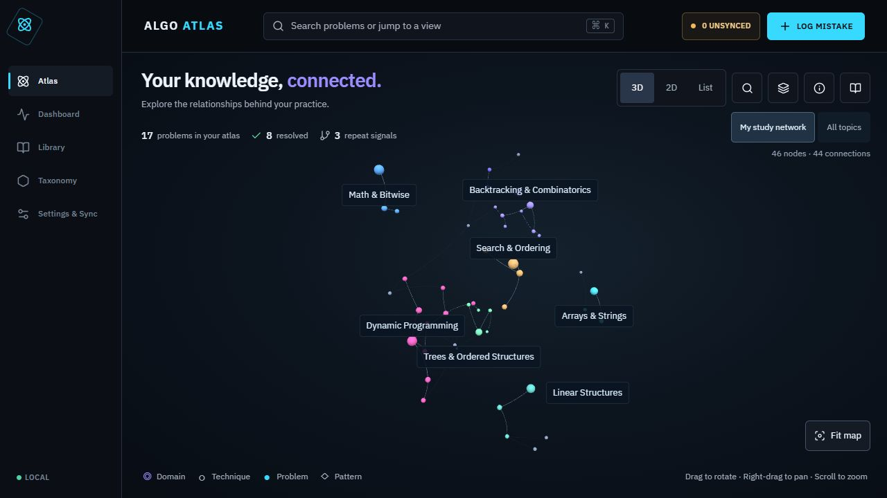
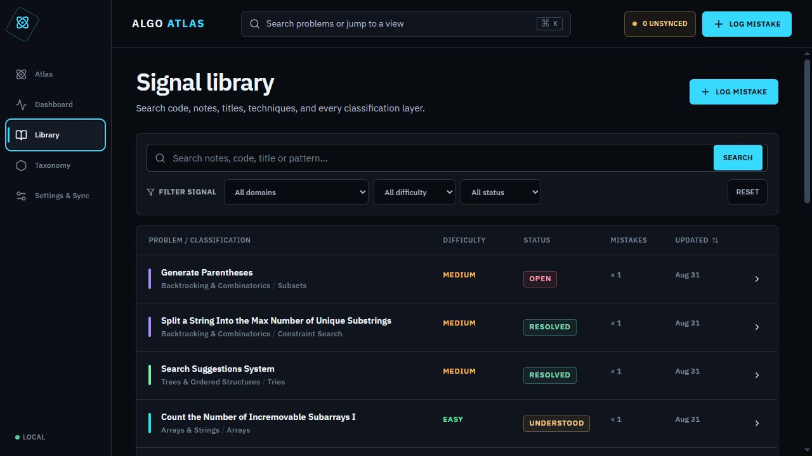
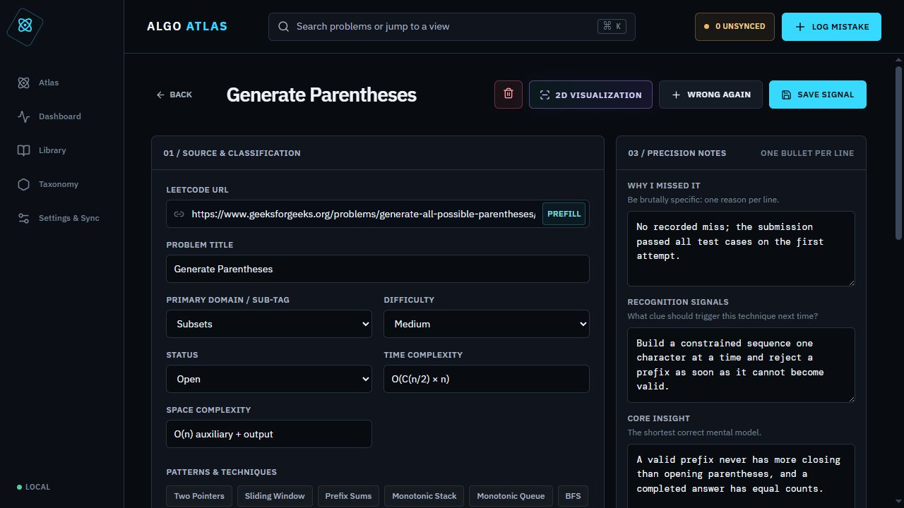
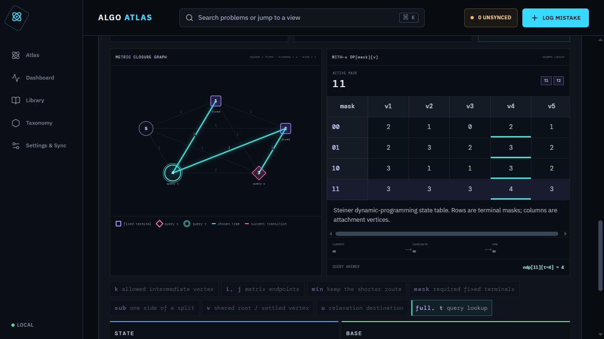
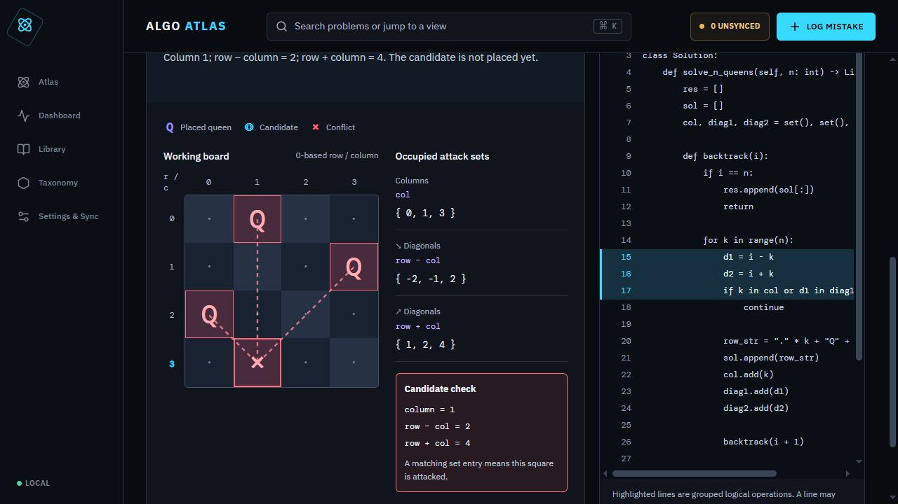
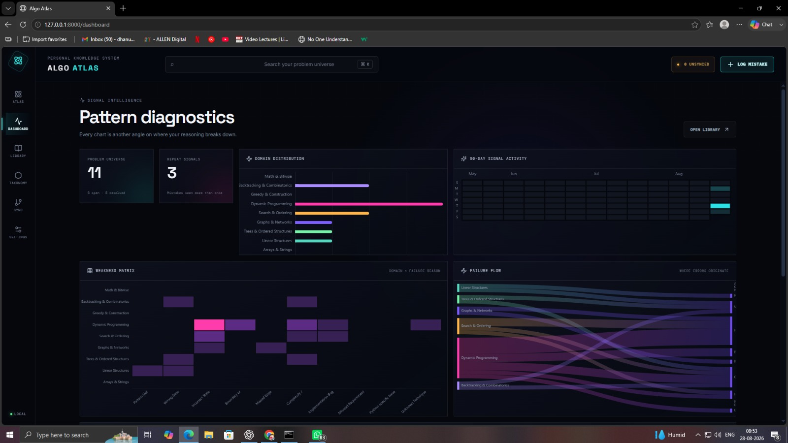
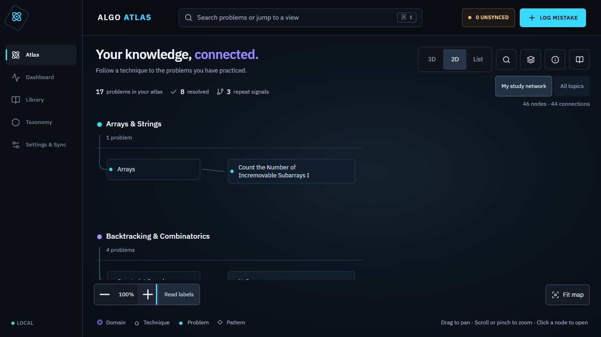
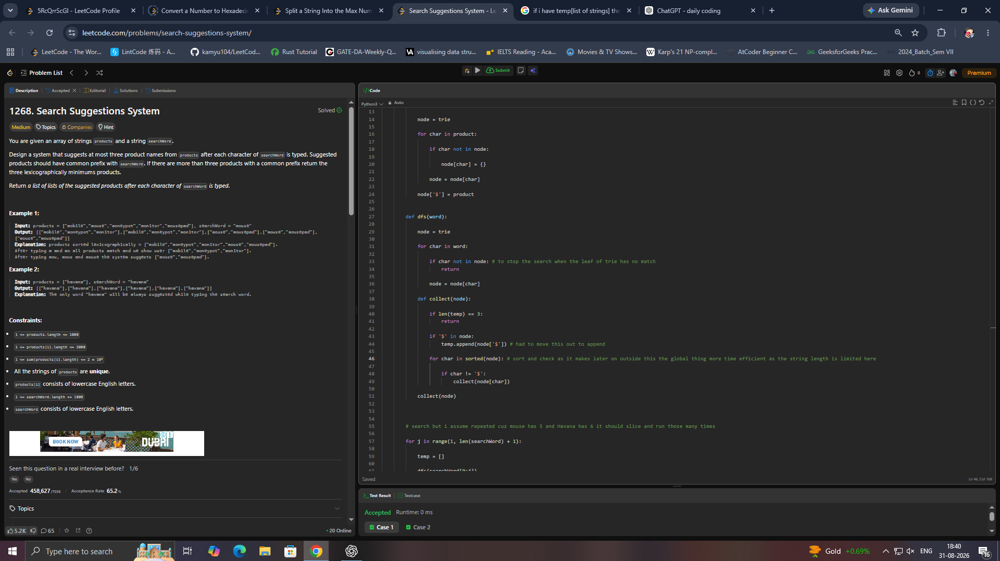
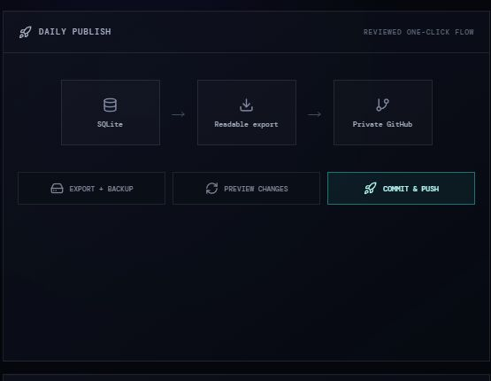

# Algo Atlas

**A local-first learning system for turning coding mistakes into reusable algorithm intuition.**

Algo Atlas keeps each problem's code, classification, failure reason, recognition signals, invariants, edge cases, and repeat-mistake history in one place. It turns those records into a searchable library, an interactive knowledge map, visual learning labs, and diagnostics that reveal recurring weaknesses.



## Why it exists

Most problem trackers remember whether a problem was solved. Algo Atlas remembers **why it was missed**, **what clue should trigger the right technique next time**, and **which mistakes keep repeating**.

- Record a problem with its URL, difficulty, status, complexity, domain, and techniques.
- Keep the full Python solution beside concise intuition notes.
- Track repeat mistakes without duplicating the problem.
- Explore Graph, DP, backtracking, binary-search, heap, and monotonic-deque ideas step by step.
- Diagnose weak domains and failure patterns from your own history.
- Keep the live SQLite database private while syncing readable exports to GitHub.

## Product tour

### Searchable problem library

Search across titles, code, notes, techniques, and classifications. Filter by domain, difficulty, or learning status to decide what to revisit next.



### Problem workspace

Every problem has one focused workspace for source information, taxonomy, complexity, Python code, precision notes, and mistake history. The code is stored for review and is never executed by the app.



The notes are intentionally structured around learning:

- **Why I missed it** — the exact reasoning failure.
- **Recognition signals** — clues that should trigger the pattern.
- **Core insight** — the shortest correct mental model.
- **Approach** — ordered reasoning steps.
- **Invariants** — facts that must remain true.
- **Edge cases** and **follow-up** — what to test or optimize next.

Use **Wrong Again** to append a new mistake event while preserving the same problem and its history.

### Interactive algorithm visualizers

Visualizers connect the state, base condition, choice, transition, invariant, and final result. They include multiple presets, step controls, playback speed, a trace timeline, and code-token-to-visual mappings.

**Steiner Tree DP:** follow the selected query tree alongside the terminal-mask state table, with the active lookup and corresponding code tokens highlighted.



**N-Queens backtracking:** inspect a candidate square's column and diagonal conflicts on the working board, alongside the attack sets and highlighted reference-code lines.



The visualizer framework is reusable across Graph and DP problems, with specialized adapters for topics such as Steiner Tree DP, monotonic queues, subsets, binary search, IPO, falling paths, and graph traversal.

### Pattern diagnostics

The dashboard summarizes the problem universe, repeated signals, domain distribution, recent activity, the weakness matrix, and the flow from algorithm domains to failure reasons.



### Knowledge constellation

The Atlas view turns stored problems and taxonomy relationships into an explorable graph. It provides a quick visual answer to: *Where are my mistakes clustering?*



### Stable taxonomy with cross-cutting signals

Each problem receives one stable primary domain/sub-tag path and can also carry multiple cross-cutting techniques. Personal tags can be added without changing the curated hierarchy.



### Reviewed GitHub sync

The database remains local. The sync workflow creates a backup, produces deterministic Markdown/Python exports, previews the Git diff, and only then commits and pushes the readable files.



## Quick start

Requirements: **Python 3.11+**, **Node.js 22.13+**, **npm**, and **Git**.

### Windows

```powershell
cd C:\Users\skibbidy\Desktop\AlgoAtlas
.\Start-AlgoAtlas.cmd
```

Stop the background server with:

```powershell
powershell.exe -NoProfile -ExecutionPolicy Bypass -File .\Stop-AlgoAtlas.ps1
```

### macOS

After cloning the repository, double-click `Start-AlgoAtlas.command` in Finder. You can also launch it from Terminal:

```bash
cd /path/to/AlgoAtlas
./Start-AlgoAtlas.command
```

Use `./Start-AlgoAtlas.command --no-browser` when you do not want it to open a browser automatically. Stop the background server with:

```bash
./Stop-AlgoAtlas.command
```

Both launchers perform the same local startup flow:

1. Creates `.venv` and installs the Python package when needed.
2. Installs npm dependencies when the lockfile changes.
3. Rebuilds the frontend whenever tracked UI inputs change, including deleted files.
4. Applies database migrations.
5. Safely reconciles pulled algorithm exports with the device-local database.
6. Starts FastAPI at <http://127.0.0.1:8000/>.
7. Opens Algo Atlas in your browser.

### Updating another device

Stop Algo Atlas on that device, pull the shared branch, and reopen the normal launcher:

```bash
git pull origin main
```

The launcher rebuilds changed UI and imports non-conflicting algorithm updates. If the same problem changed on both devices, or either device deleted a problem, open **Settings & Sync** and choose **Keep this device** or **Use pulled version**. A backup is created before accepted incoming changes are applied.

Resolve ordinary Git merge conflicts before reopening Algo Atlas. The in-app **Commit & Push** action publishes only `exports/`; UI and application-source changes require a normal Git commit and push.

## Development

Run the backend and Vite frontend separately when changing the source:

Windows PowerShell:

```powershell
cd C:\Users\skibbidy\Desktop\AlgoAtlas
npm install
python -m venv .venv
.\.venv\Scripts\python.exe -m pip install -e ".[dev]"
.\.venv\Scripts\python.exe -m algo_atlas.bootstrap
.\.venv\Scripts\python.exe -m uvicorn algo_atlas.main:app --host 127.0.0.1 --port 8000 --reload
```

macOS Terminal:

```bash
cd /path/to/AlgoAtlas
npm install
python3 -m venv .venv
./.venv/bin/python -m pip install -e ".[dev]"
./.venv/bin/python -m algo_atlas.bootstrap
./.venv/bin/python -m uvicorn algo_atlas.main:app --host 127.0.0.1 --port 8000 --reload
```

In a second terminal window:

```bash
npm run dev
```

Vite runs at <http://127.0.0.1:5173/> and proxies `/api` to FastAPI.

## Data, GitHub, and recovery

```text
.local/algo_atlas.db
        │
        ├── live local data, ignored by Git
        ├── FTS5 search index
        └── rolling local backups
                 │
                 ▼
exports/catalog.json + per-problem README.md + solution.py
                 │
                 └── reviewed, Git-tracked recovery format
```

- `.local/algo_atlas.db` is the local SQLite source of truth and is intentionally not stored on GitHub.
- `.local/backups/` keeps the latest 14 pre-export or pre-restore snapshots.
- `exports/catalog.json` stores stable IDs, taxonomy definitions, schema information, and content hashes.
- `exports/<domain>/<sub-tag>/<problem>/README.md` stores readable metadata and structured notes.
- Each exported problem includes a standalone `solution.py`.

On a fresh clone, startup validates every tracked export and reconstructs the local database. On later pulls it compares the last accepted export, the current local record, and the incoming record by normalized content. Incoming-only changes apply automatically; local-only edits remain local; two-device edits and deletions require review in **Settings & Sync**.

## Troubleshooting a fresh clone

- **The app does not show pulled UI or algorithms:** stop the server, confirm `git pull origin main` succeeds without merge conflicts, and reopen the normal launcher. It will rebuild stale UI and reconcile the tracked export.
- **Publishing is blocked by sync conflicts:** open **Settings & Sync**, review every listed problem, apply the choices, then preview and publish again.
- **`Permission denied` on macOS:** run `chmod +x Start-AlgoAtlas.command Stop-AlgoAtlas.command` once, then retry.
- **Python or Node is rejected:** verify `python3 --version` is at least 3.11 and `node --version` is at least 22.13.
- **The server does not start on macOS:** inspect `.local/server.log` for the actionable startup error.
- **An export is rejected:** do not edit `catalog.json`, an exported README, or `solution.py` by hand. Pull the reviewed export again so its stored hashes match.

## GitHub setup

1. Create an empty private GitHub repository.
2. Open **Settings & Sync** in Algo Atlas.
3. Enter the remote URL, branch, Git name, and Git email.
4. Select **Export + Backup**.
5. Select **Preview Changes** and review the allowlisted export diff.
6. Select **Commit & Push**.

Algo Atlas stages only `exports/` from the in-app sync flow. Credentials are delegated to Git Credential Manager or SSH and are never stored by the application.

## Architecture

- **Frontend:** React 19, TypeScript, Vite, Monaco Editor, ECharts, Three.js.
- **Backend:** FastAPI, SQLAlchemy, Alembic, Pydantic.
- **Storage:** SQLite with WAL, foreign keys, and FTS5 search.
- **Exports:** deterministic JSON, Markdown, and Python files.
- **Privacy:** local origin, no accounts, no cloud database, no solution execution.

## Quality checks

```powershell
npm run build
.\.venv\Scripts\python.exe -m pytest
```

## Repository layout

```text
backend/            FastAPI application, database, import/export, migrations
src/                React application and reusable visualizer system
tests/              Backend and workflow tests
exports/            Git-friendly catalog and per-problem learning records
docs/images/        Screenshots used by this README
Start-AlgoAtlas.cmd Windows launcher
Start-AlgoAtlas.command macOS launcher
```
